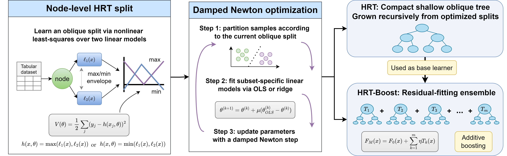

# HRT-Boost

[](LICENSE)
[](pyproject.toml)

Official implementation of **HRT-Boost**, a compact tabular regression method
that boosts Hinge Regression Tree (HRT) base learners. This release is centered
on HRT-Boost; the single-tree HRT implementation and external baselines are
provided for ablation and benchmark comparison.

<p align="center">
  
</p>

## Paper

**Hinge Regression Trees and HRT-Boost: Newton-Optimized Oblique Learning for
Compact Tabular Models**

Hongyi Li, Jun Xu*, Hong Yan

*(Preprint coming soon)*

## Relation to Hinge Regression Tree

HRT-Boost builds on **Hinge Regression Tree (HRT)** base learners. The original single-tree HRT reference implementation is available at [Hongyi-Li-sz/Hinge-Regression-Tree](https://github.com/Hongyi-Li-sz/Hinge-Regression-Tree).

In short:

- **HRT** is the single-tree model and splitting algorithm.
- **HRT-Boost** is the boosted ensemble method built from HRT base learners.

## Installation

Clone the official HRT-Boost repository:

```bash
git clone https://github.com/Hongyi-Li-sz/HRT-Boost.git
```
```bash
cd HRT-Boost
```

Install the core package:

```bash
pip install -e .
```

Install benchmark dependencies, including classical tree baselines:

```bash
pip install -e ".[benchmark]"
```

Install optional deep tabular baselines:

```bash
pip install -e ".[benchmark,deep]"
```

Install development tools:

```bash
pip install -e ".[dev]"
```

## Quick start

Run the default HRT-Boost demo:

```bash
python scripts/run_quick_demo.py
```

Run the HRT-Boost demo plus the single-tree HRT ablation:

```bash
python scripts/run_quick_demo.py --include-hrt
```

Use HRT-Boost in Python:

```python
from hrt_boost import HRTBoostingRegressor

model = HRTBoostingRegressor(
    n_estimators=50,
    learning_rate=0.1,
    max_depth=2,
    random_state=42,
)
model.fit(X_train, y_train)
y_pred = model.predict(X_test)
```

## Benchmark

Place datasets under `data/raw/` and run the official default benchmark. The
default evaluates HRT-Boost only.

```bash
python scripts/run_benchmark.py
```

Run HRT-Boost together with the single-tree HRT ablation and selected baselines:

```bash
RUN_METHODS="HRT-Boost,HRT,CART,RF,XGBoost" python scripts/run_benchmark.py
```

Run all available methods:

```bash
RUN_METHODS="all" python scripts/run_benchmark.py
```

Run all available methods and skip optional neural baselines:

```bash
RUN_METHODS="all,-TabM,-TabNet" python scripts/run_benchmark.py
```

Useful method groups are `official`, `hrt`, `hrtboost`, `baselines`,
`classical`, `tree`, `deep`, and `all`. Outputs are written to `outputs/` by
default.

```bash
DATA_DIR=/path/to/data OUTPUT_DIR=/path/to/results python scripts/run_benchmark.py
```

## Repository layout

```text
hrt_boost/                    Importable HRT and HRT-Boost estimators
scripts/run_quick_demo.py     Synthetic-data smoke test for HRT-Boost
scripts/run_benchmark.py      Benchmark script with optional baselines
tests/                        Basic pytest checks
docs/DATASETS.md              Dataset placement and licensing notes
docs/RELEASE_CHECKLIST.md     Public-release checklist
```

## License

MIT (see `LICENSE`).


## Citation


```bibtex
@article{li2026hrt_boost,
  title={Hinge Regression Trees and HRT-Boost: Newton-Optimized Oblique Learning for Compact Tabular Models},
  author={Li, Hongyi and Xu, Jun and Yan, Hong},
}
